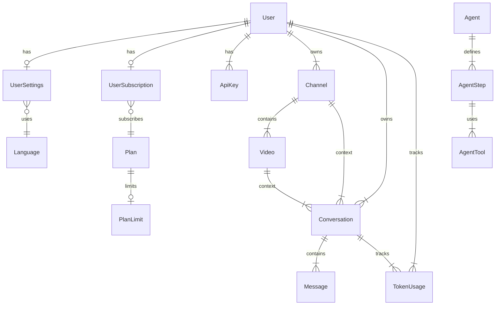

# 🗄️ Documentación de Base de Datos e Infraestructura

## 📌 Esquema de Base de Datos (Prisma 7.10 + Supabase PostgreSQL)

### Configuración

```prisma
datasource db {
  provider = "postgresql"
  schemas  = ["public", "auth", "vault"]
}

generator client {
  provider        = "prisma-client-js"
  previewFeatures = ["multiSchema"]
}
```

**Multi-Schema:** El proyecto utiliza 3 esquemas de PostgreSQL:
- `public` — Todos los modelos de la aplicación
- `auth` — Manejado por Supabase Auth (usuarios, sesiones)
- `vault` — Supabase Vault (almacenamiento encriptado de API Keys)

**Cliente Prisma:** Inicializado en [`src/prisma/db.ts`](file:///e:/AutoProd/src/prisma/db.ts) como singleton con `@prisma/adapter-pg` y pool de conexiones `pg`:

```typescript
import { Pool } from 'pg';
import { PrismaPg } from '@prisma/adapter-pg';
import { PrismaClient } from '@prisma/client';

const pool = new Pool({ connectionString: process.env.DATABASE_URL });
const adapter = new PrismaPg(pool);
const prisma = new PrismaClient({ adapter });
```

---

### Diagrama de Relaciones (ER)



---

### Modelo de Datos Completo (`prisma/schema.prisma`)

#### Usuarios y Configuración

```prisma
model User {
  id               String            @id @default(uuid())
  email            String            @unique
  name             String?
  role             String            @default("USER")
  geminiVaultId    String?           // Supabase Vault secret ID
  openaiVaultId    String?           // Supabase Vault secret ID
  anthropicVaultId String?           // Supabase Vault secret ID
  subscription     UserSubscription?
  settings         UserSettings?
  apiKeys          ApiKey[]
  channels         Channel[]
  conversations    Conversation[]
  tokenUsages      TokenUsage[]
  createdAt        DateTime          @default(now())
  @@map("user")
  @@schema("public")
}

model Language {
  code      String         @id      // "es", "en", "pt", "fr"
  name      String
  settings  UserSettings[]
  @@map("language")
  @@schema("public")
}

model UserSettings {
  id                 String   @id @default(uuid())
  userId             String   @unique
  languageCode       String   @default("es")
  theme              String   @default("dark")
  emailNotifications Boolean  @default(true)
  defaultResolution  String   @default("1080p")
  @@map("userSettings")
  @@schema("public")
}

model ApiKey {
  id        String   @id @default(uuid())
  userId    String
  provider  String   // "GOOGLE", "OPENAI", "ANTHROPIC"
  key       String
  @@unique([userId, provider])
  @@map("apiKey")
  @@schema("public")
}
```

#### Suscripciones y Planes

```prisma
model UserSubscription {
  id               String   @id @default(uuid())
  userId           String   @unique
  planId           String
  status           String   @default("active")
  currentPeriodEnd DateTime @default(dbgenerated("NOW() + interval '1 year'"))
  @@map("userSubscription")
  @@schema("public")
}

model Plan {
  id            String             @id @default(uuid())
  name          String             @unique  // "FREE", "PRO", "ENTERPRISE"
  priceId       String?            // Lemon Squeezy / Stripe Price ID
  subscriptions UserSubscription[]
  limits        PlanLimit?
  @@map("plan")
  @@schema("public")
}

model PlanLimit {
  id                      String  @id @default(uuid())
  planId                  String  @unique
  maxChannels             Int     @default(2)
  maxVideosPerChannel     Int     @default(10)
  canRenderInCloud        Boolean @default(false)
  maxMonthlyRenderMinutes Int     @default(0)
  hasAdvancedTemplates    Boolean @default(false)
  @@map("planLimit")
  @@schema("public")
}
```

#### Contenido (Canales, Videos, Conversaciones)

```prisma
model Channel {
  id               String         @id @default(uuid())
  name             String
  userId           String
  videos           Video[]
  conversations    Conversation[]
  youtubeChannelId String?        @unique
  accessToken      String?
  refreshToken     String?
  tokenExpiry      DateTime?
  profilePicture   String?
  createdAt        DateTime       @default(now())
  @@map("channel")
  @@schema("public")
}

model Video {
  id             String         @id @default(uuid())
  name           String
  channelId      String
  title          String?
  description    String?
  tags           String?
  status         String         @default("DRAFT")
  youtubeVideoId String?        @unique
  conversations  Conversation[]
  createdAt      DateTime       @default(now())
  @@map("video")
  @@schema("public")
}

model Conversation {
  id           String    @id @default(uuid())
  title        String    @default("Nueva conversación")
  systemPrompt String?
  userId       String
  channelId    String?
  videoId      String?
  messages     Message[]
  tokenUsages  TokenUsage[]
  createdAt    DateTime  @default(now())
  updatedAt    DateTime  @updatedAt
  @@map("conversation")
  @@schema("public")
}

model Message {
  id             String       @id @default(uuid())
  conversationId String
  sender         String       // "USER", "GEMINI"
  text           String
  createdAt      DateTime     @default(now())
  @@map("message")
  @@schema("public")
}
```

#### Sistema de Agentes (Catálogo Dinámico)

```prisma
model Agent {
  id           String      @id @default(uuid())
  slug         String      @unique  // "channel_architect", "workspace_list"
  name         String
  description  String?
  systemPrompt String
  steps        AgentStep[]
  createdAt    DateTime    @default(now())
  @@map("agent")
  @@schema("public")
}

model AgentStep {
  id                    String      @id @default(uuid())
  agentId               String
  stepOrder             Int
  stepName              String
  apiEndpoint           String      // "/api/agents/movement" o "LOCAL:workspace_list"
  method                String      @default("POST")
  dynamicPromptTemplate String?
  tools                 AgentTool[]
  @@map("agentStep")
  @@schema("public")
}

model AgentTool {
  id       String    @id @default(uuid())
  stepId   String
  toolName String
  @@map("agentTool")
  @@schema("public")
}

model PromptTemplate {
  id           String   @id @default(uuid())
  name         String   @unique  // "orchestrator_base", "tool_injection", "crear_canal"
  systemPrompt String
  welcomeText  String?
  description  String?
  @@map("promptTemplate")
  @@schema("public")
}
```

#### Tracking de Tokens

```prisma
model TokenUsage {
  id               String        @id @default(uuid())
  userId           String
  conversationId   String?
  provider         String        // "gemini", "openai", "anthropic"
  modelName        String        // "gemini-3.6-flash", "gpt-4o"
  promptTokens     Int
  completionTokens Int
  totalTokens      Int
  createdAt        DateTime      @default(now())
  @@map("tokenUsage")
  @@schema("public")
}
```

---

## 🏗️ Infraestructura como Código (Terraform)

Toda la infraestructura se despliega automáticamente ejecutando:

```bash
terraform init
terraform apply
```

Archivos de Terraform:
* `terraform/main.tf`: Configuración de proveedores (Vercel + Supabase).
* `terraform/variables.tf`: Definición de variables de entorno y secrets.

---

## 🔑 Supabase Vault — Encriptación de API Keys

El flujo de encriptación de API Keys usa **Supabase Vault**, no la tabla `ApiKey` directamente:

1. El frontend envía la API Key a `/api/settings/keys`.
2. El backend la inserta en Vault via `supabase.rpc()`.
3. Se guarda el `secretId` retornado en el campo correspondiente del User (`geminiVaultId`, `openaiVaultId`, `anthropicVaultId`).
4. Para desencriptar: `supabase.rpc('get_decrypted_secret', { p_secret_id: secretId })`.

---

## 🔄 Gestión de Migraciones SQL y Prisma

Todas las migraciones de esquema y datos de arranque residen en el directorio `migrations/` y deben seguir una convención estricta:

### Estándar de Nomenclatura Secuencial:
- Prefijo numérico correlativo de 3 dígitos con ceros a la izquierda:
  - `migrations/003_baseline_orchestrator_and_prompts.sql`
  - `migrations/004_ip_registration_and_anti_abuse.sql`
  - `migrations/005_nombre_de_la_nueva_feature.sql` *(Próxima migración)*
  - `migrations/006_...`
  - Y así sucesivamente.

### Reglas de Oro:
1. **Idempotencia:** Toda sentencia debe poder ejecutarse múltiples veces sin fallar (`IF NOT EXISTS`, `ON CONFLICT DO NOTHING / UPDATE`).
2. **Sincronización Dual:** Cada cambio en base de datos debe reflejarse en [`prisma/schema.prisma`](file:///e:/autoprod/prisma/schema.prisma) y regenerarse el cliente con:
   ```bash
   pnpm exec prisma generate
   ```
3. **Cero Seeds Manuales en Runtime:** Prohibido crear endpoints temporales para insertar schemas o datos base en la base de datos en producción.
