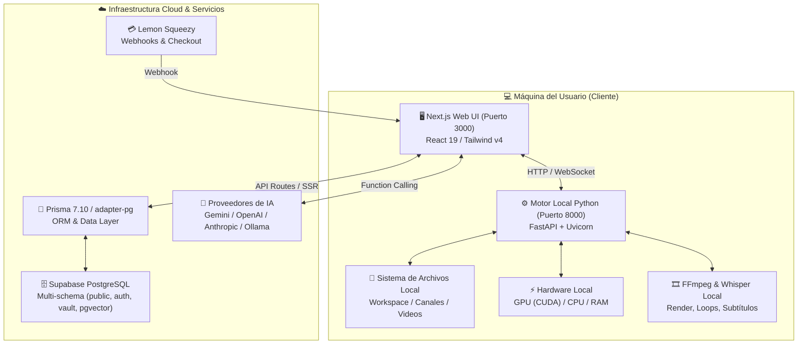

# ⚙️ Ficha Técnica Macro: AutoProd IDE Architecture

> **Sistema:** AutoProd Console & Production IDE  
> **Versión de Arquitectura:** 2.0 (Agéntica Híbrida Descentralizada)  
> **Patrón Rector:** $0 Server Cost — Procesamiento pesado en máquina local (FastAPI / FFmpeg / Whisper) + Orquestación en Nube Ligera (Next.js / Prisma / Supabase).

---

## 🏗️ 1. Diagrama de Arquitectura Global

---

## 📦 2. Stack Tecnológico Central

| Capa | Tecnología | Versión | Propósito |
|---|---|---|---|
| **Frontend Framework** | Next.js (App Router, Turbopack) | `16.3.3` | Interfaz estilo IDE con paneles redimensionables y reactividad instantánea. |
| **Biblioteca UI** | React | `19.0.0` | Renderizado declarativo, hooks de estado y concurrencia. |
| **Estilos & Diseño** | Tailwind CSS | `v4.0.0` | Diseño oscuro premium, glassmorphism y micro-interacciones. |
| **ORM & Base de Datos** | Prisma (`@prisma/adapter-pg`) + Supabase | `7.10.0` | Multi-schema (`public`, `auth`, `vault`, `pgvector`), tipado estricto. |
| **Seguridad & Vault** | Supabase Vault RPC | — | Encriptación/desencriptación en runtime de API keys de usuarios (BYOK). |
| **Orquestador Agéntico** | Vercel AI SDK | `v3.x / v4.x` | Function Calling dinámico con esquemas JSON inyectados desde BD. |
| **Motor Local (OS Engine)** | FastAPI + Uvicorn (Python) | `3.10+` | Interacción directa con el disco duro, explorer nativo y hardware. |
| **Procesamiento Multimedia** | FFmpeg + Moviepy + Silero VAD | `6.x+` | Render de video looper, sincronización de audio y Voice Activity Detection. |
| **Reconocimiento de Voz** | Whisper (OpenAI Local / API) | Latest | Transcripción precisa con marcas de tiempo por palabra y salida CapCut. |
| **Monetización** | Lemon Squeezy SDK + Nequi | — | Suscripciones recurrentes, portal de cliente y confirmación manual Nequi. |

---

## 📂 3. Estructura de Directorios Clave

- [`app/`](file:///e:/autoprod/app): Rutas del frontend y endpoints API de Next.js.
  - [`app/dashboard/`](file:///e:/autoprod/app/dashboard): IDE central con paneles modulares.
  - [`app/api/chat/route.ts`](file:///e:/autoprod/app/api/chat/route.ts): Chat universal con tool loop agéntico.
  - [`app/api/user/wallet/route.ts`](file:///e:/autoprod/app/api/user/wallet/route.ts): Balance de créditos y consumo de tokens.
- [`components/dashboard/`](file:///e:/autoprod/components/dashboard): Componentes del IDE (ChatPanel, FileTree, Launchpad, SubscriptionPlansModal, etc.).
- [`controlador/`](file:///e:/autoprod/controlador): Código fuente del Motor Python FastAPI.
  - [`controlador/main.py`](file:///e:/autoprod/controlador/main.py): Punto de entrada y configuración de routers.
  - [`controlador/workspace.py`](file:///e:/autoprod/controlador/workspace.py): CRUD de archivos y explorador nativo.
  - [`controlador/whisper_engine.py`](file:///e:/autoprod/controlador/whisper_engine.py): Transcripción y VAD.
  - [`controlador/video_processor.py`](file:///e:/autoprod/controlador/video_processor.py): Generación de loops y render.
- [`lib/`](file:///e:/autoprod/lib): Librerías internas y clientes (Auth Guard, Controlador Client, Pricing Config, Supabase).
- [`prisma/`](file:///e:/autoprod/prisma): Esquema de datos multi-schema y migraciones.

---

## ⚡ 4. Capacidades Técnicas Globales Implementadas (`✅ HECHO`)

1. **Doble Verificación de Autenticación (Fast-Path 0ms):**
   - Decodificación síncrona del JWT de la cookie SSR con fallback a red vía Supabase Auth.
2. **BYOK Seguro con Supabase Vault:**
   - Almacenamiento cifrado de API keys de Google Gemini, OpenAI y Anthropic. Las claves nunca viajan en texto plano al frontend.
3. **Tool Loop Agéntico Multi-Provider:**
   - Capacidad de interceptar llamadas locales (`LOCAL:*`) para que el motor de Python las resuelva en disco, reinyectando el resultado al prompt en hasta 5 iteraciones automáticas.
4. **Hardware Governor & Aislamiento Local:**
   - Semáforos de concurrencia y límites de uso de CPU/GPU para evitar que renders pesados o Whisper congelen la máquina del usuario.
5. **Economía de Tokens y Cuota Gratuita:**
   - Modelo gratuito asistido por `gpt-4o-mini` (costo insignificante absorbido por AutoProd), complementado con saldo de créditos deducible o BYOK del usuario.
