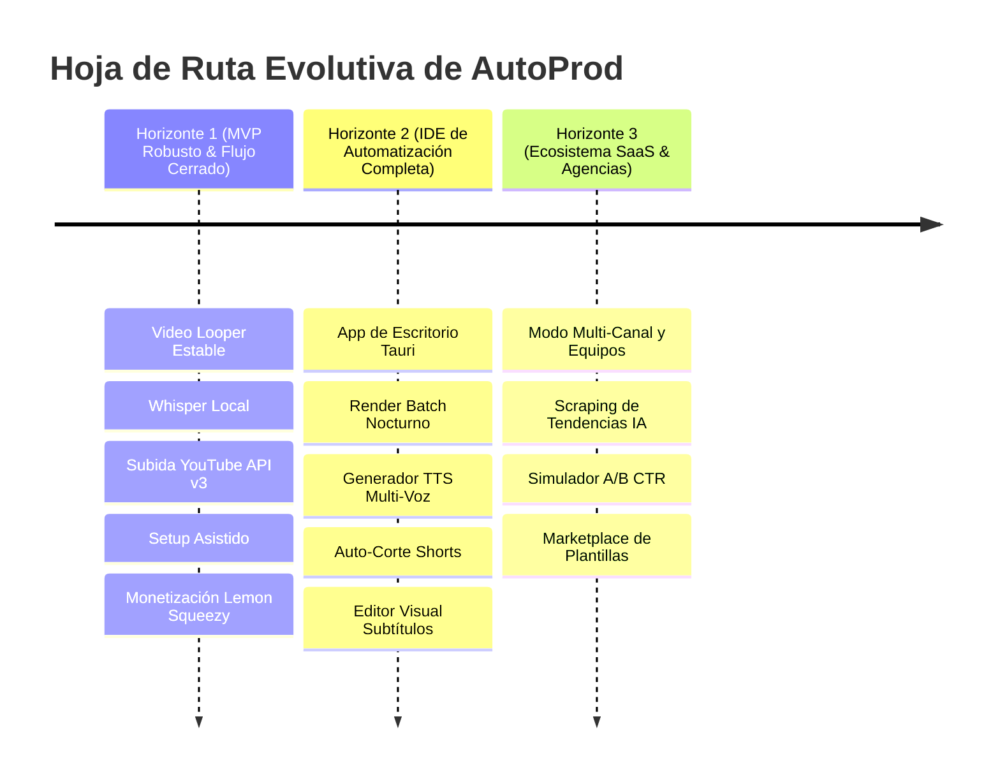

# 💡 Visión Macro: AutoProd — El Sistema Operativo para Canales de Contenido

> **Definición Oficial de Producto:**  
> **AutoProd es el sistema operativo para canales de contenido.**  
> Un espacio donde los creadores y operadores de canales organizan sus proyectos, desarrollan ideas, producen contenido de alta calidad con sus propios recursos, analizan resultados y construyen un workflow de producción que se adapta a su forma de crear.

> **Manifiesto de Marca:**  
> *«La automatización no reemplaza al creador. Le devuelve tiempo para crear.»*  
> *«Automatiza el trabajo. Conserva el control.»*

---

## 🧭 1. El Propósito Central de AutoProd

La producción de videos para YouTube hoy en día está fragmentada y rota:
- Un creador pasa horas saltando entre Premiere/CapCut, ChatGPT, generadores de miniaturas, herramientas de SEO, carpetas desordenadas en Windows y la consola de YouTube Studio.
- Las plataformas en la nube existentes cobran suscripciones carísimas ($50-$200/mes) porque intentan renderizar video en servidores remotos (lo cual dispara sus costos en AWS/GCP y limita la calidad del video a 1080p comprimido).
- **El verdadero diferencial de AutoProd no es "hacer videos con un bot", sino reunir todo el proceso en un solo sistema operativo.**

### Los 4 Pilares del Sistema Operativo:
1. **CREA (Convierte tus ideas en contenido con intención):** Investiga temas, desarrolla conceptos, contempla distintos escenarios narrativos y dale estructura a tus guiones sin perder la identidad de cada canal.
2. **PRODUCE (Todo lo que necesitas para crear, en un solo lugar):** Ensambla bucles continuos de 1 a 3 horas, recorta clips rápidos para Shorts y genera subtítulos palabra por palabra sin depender de un flujo fragmentado.
3. **ANALIZA (Entiende qué está pasando con tus canales):** Consulta referencias, explora enfoques de otros creadores y encuentra información que te ayude a decidir qué crear, qué mejorar y dónde existen nuevas oportunidades.
4. **ESCALA (Más capacidad. Más control. Menos trabajo repetitivo):** Organiza múltiples canales de forma independiente y construye un workflow de producción predecible para dedicar más tiempo a las decisiones importantes y menos a las tareas mecánicas.

### La Ventaja de Ejecución: Tu Contenido. Tu Equipo. Tu Control.
1. **Velocidad real:** Renders hasta 4K aprovechando la potencia del computador del usuario, sin esperas ni colas remotas.
2. **Costos predecibles:** Sin tarifas arbitrarias por segundo o minuto de video renderizado.
3. **Control y Privacidad absoluta:** Los archivos originales, metraje y recursos del creador jamás se secuestran en servidores externos; permanecen bajo su soberanía.

---

## 📊 2. Comparativa: Lo que Tenemos Hoy vs. Hacia Dónde Vamos

| Dimensión | 📍 Lo que Tenemos Hoy (Estado Actual) | 🚀 Hacia Dónde Vamos (Visión Futura) |
|---|---|---|
| **Público Objetivo** | Creadores solistas técnicos que producen canales de música, lofi y contenido automatizado. | Creadores individuales, agencias de contenido, editores y equipos multi-canal (Modo Agencia y Multi-Tenant). |
| **Distribución de Software** | Aplicación web (`localhost:3000`) que requiere que el usuario clone el repo y corra comandos en terminal (`pnpm dev`, `python main.py`). | **App de Escritorio Nativa (Tauri / Electron)** con instalador `.exe`/`.dmg` en 1 clic. El motor Python corre como servicio en segundo plano invisible. |
| **Setup de Dependencias** | El usuario debe tener instalado Python, FFmpeg y librerías en su sistema operativo. | **`autoprod-setup` 100% automatizado:** Asistente integrado que descarga y configura FFmpeg, yt-dlp y modelos de Whisper sin tocar la terminal. |
| **Flujo de Video** | Video Looper con sincronización de música y previsualizador de 5 min (1 video a la vez). | **Fábrica de Contenido Batch & Pipeline Completo:** Cola de 50 videos que renderizan de noche + Auto-corte automático a YouTube Shorts/TikTok (9:16). |
| **Voz & Narración** | Dependencia de pistas de audio preexistentes en la carpeta local. | **Generador TTS Multi-Voz Integrado:** Edge-TTS gratuito ilimitado local + ElevenLabs hiperrealista con clonación de voz. |
| **Subtítulos** | Extracción Whisper con Silero VAD y exportación a archivos `.srt`/`.vtt` para CapCut. | **Editor de Timeline Visual Interactivo** con quemado hard/soft de subtítulos animados cinemáticos dentro de AutoProd. |
| **Integración con YouTube** | Extracción de metadatos de canales existentes con pgvector para enriquecer contexto. | **Ciclo Cerrado de Publicación (End-to-End):** OAuth 2.0, subida desatendida vía API v3, selector de miniaturas, programación en calendario y métricas de retención en vivo. |
| **Inteligencia Agéntica** | Chat multi-provider con tool calls para leer/escribir archivos locales. | **Agentes Autónomos Especializados:** Agente Investigador de Tendencias, Agente Analista de Retención de Guiones y Simulador A/B de Miniaturas. |
| **Monetización** | Planes Starter ($70), Pro ($100) y Enterprise ($150) vía Lemon Squeezy y Nequi manual. | SaaS global con facturación automática, licencias por máquina offline, add-ons de créditos y Marketplace de Plantillas de la comunidad. |

---

## 🎯 3. Los 3 Horizontes de Crecimiento de AutoProd

### 🟢 Horizonte 1: El Loop de Producción Cerrado (Presente Inmediato)
- Terminar las dependencias del instalador local (`autoprod-setup`).
- Cerrar el ciclo: que el video terminado se suba automáticamente a YouTube con sus tags, descripción SEO y miniatura sin salir de AutoProd.
- Consolidar la adquisición de los primeros 100 clientes de pago en los planes de $70, $100 y $150 USD.

### 🟡 Horizonte 2: La Suite Todo-en-Uno (Mediano Plazo)
- Eliminar la fricción de instalación técnica creando el ejecutable de escritorio `.exe`.
- Integrar generación de voz (TTS) para no depender de grabaciones manuales de locutores.
- Implementar cola de producción en segundo plano (Batch Queue) para que el computador trabaje mientras el creador duerme.

### 🟣 Horizonte 3: La Plataforma de Escala Masiva (Largo Plazo)
- Permitir que agencias administren 20+ canales de YouTube con roles de equipo.
- IA predictiva: la plataforma no solo genera el video, sino que predice qué miniatura y qué gancho (hook) tendrán mayor CTR antes de publicar.
- Comunidad y Marketplace donde creadores vendan sus plantillas de guiones, presets de looper y flujos agénticos.

---

## 💎 4. Principios Innegociables de Producto

1. **Filosofía $0 en Costos de Servidor Innecesarios:**  
   El servidor nunca debe procesar un solo frame de video. Todo el cómputo pesado ocurre en el hardware que el cliente ya posee.
2. **Privacidad y Control Absoluto:**  
   El contenido del creador (archivos originales, audios, recursos) se queda en su disco duro local; AutoProd no secuestra sus archivos ni depende de almacenamiento en la nube obligatorio.
3. **Autonomía con Control Humano (Human-in-the-Loop):**  
   Los agentes de IA proponen, redactan y ejecutan tareas repetitivas, pero el creador siempre tiene la última palabra antes de publicar o gastar créditos.
