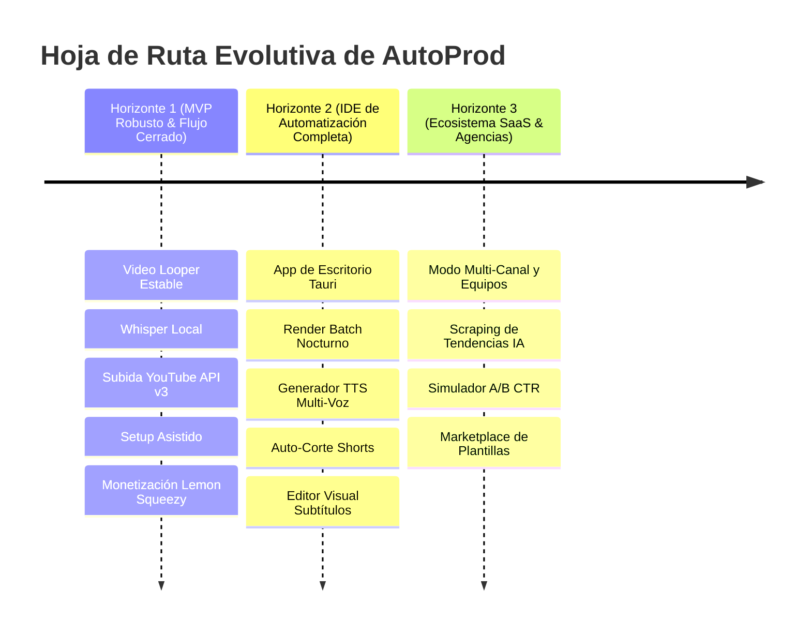

# 💡 Visión Macro: AutoProd — Lo que Tenemos vs. Hacia Dónde Vamos

> **Visión:** Convertir a AutoProd en el **Sistema Operativo y Entorno de Desarrollo Integrado (IDE)** definitivo para creadores, productores y agencias de automatización de contenidos para YouTube.

---

## 🧭 1. El Propósito Central de AutoProd

La producción de videos para YouTube hoy en día está rota:
- Un creador pasa horas saltando entre Premiere/CapCut, ChatGPT, generadores de miniaturas, herramientas de SEO, carpetas desordenadas en Windows y la consola de YouTube Studio.
- Las plataformas en la nube existentes cobran suscripciones carísimas ($50-$200/mes) porque intentan renderizar video en servidores remotos (lo cual dispara sus costos en AWS/GCP y limita la calidad del video a 1080p comprimido).

### La Disrupción de AutoProd:
AutoProd cambia las reglas del juego mediante una **arquitectura híbrida descentralizada**:
1. **La inteligencia y la UX viven en la nube y en el navegador:** Un IDE moderno y elegante (Next.js) que orquesta agentes de IA.
2. **El músculo pesado vive en la máquina del usuario:** Un motor local en Python (`localhost:8000`) aprovecha la GPU (NVIDIA CUDA), CPU y disco duro del cliente para renderizar loops en 4K, transcribir con Whisper y organizar archivos a **$0 costo de servidor para AutoProd**.

---

## 📊 2. Comparativa: Lo que Tenemos Hoy vs. Hacia Dónde Vamos

| Dimensión | 📍 Lo que Tenemos Hoy (Estado Actual) | 🚀 Hacia Dónde Vamos (Visión Futura) |
|---|---|---|
| **Público Objetivo** | Creadores solistas técnicos que producen canales de música, lofi y contenido automatizado. | Creadores individuales, agencias de contenido, editores y equipos multi-canal (Modo Agencia y Multi-Tenant). |
| **Distribución de Software** | Aplicación web (`localhost:3000`) que requiere que el usuario clone el repo y corra comandos en terminal (`pnpm dev`, `python main.py`). | **App de Escritorio Nativa (Tauri / Electron)** con instalador `.exe`/`.dmg` en 1 clic. El motor Python corre como servicio en segundo plano invisible. |
| **Setup de Dependencias** | El usuario debe tener instalado Python, FFmpeg y librerías en su sistema operativo. | **`autoprod-setup` 100% automatizado:** Asistente integrado que descarga y configura FFmpeg, yt-dlp y modelos de Whisper sin tocar la terminal. |
| **Flujo de Video** | Video Looper con sincronización de música y previsualizador de 5 min (1 video a la vez). | **Fábrica de Contenido Batch & Pipeline Completo:** Cola de 50 videos que renderizan de noche + Auto-corte automático a YouTube Shorts/TikTok (9:16). |
| **Voz & Narración** | Dependencia de pistas de audio preexistentes en la carpeta local. | **Generador TTS Multi-Voz Integrado:** Edge-TTS gratuito ilimitado local + ElevenLabs hiperrealista con clonación de voz. |
| **Subtítulos** | Extracción Whisper con Silero VAD y exportación a archivos `.srt`/`.vtt` para CapCut. | **Editor de Timeline Visual Interactivo** con quemado hard/soft de subtítulos animados cinemáticos dentro de AutoProd. |
| **Integración con YouTube** | Extracción de metadatos de canales existentes con pgvector para enriquecer contexto. | **Ciclo Cerrado de Publicación (End-to-End):** OAuth 2.0, subida desatendida vía API v3, selector de miniaturas, programación en calendario y métricas de retención en vivo. |
| **Inteligencia Agéntica** | Chat multi-provider con tool calls para leer/escribir archivos locales. | **Agentes Autónomos Especializados:** Agente Investigador de Tendencias, Agente Analista de Retención de Guiones y Simulador A/B de Miniaturas. |
| **Monetización** | Planes Starter ($70), Pro ($100) y Enterprise ($150) vía Lemon Squeezy y Nequi manual. | SaaS global con facturación automática, licencias por máquina offline, add-ons de créditos y Marketplace de Plantillas de la comunidad. |

---

## 🎯 3. Los 3 Horizontes de Crecimiento de AutoProd

### 🟢 Horizonte 1: El Loop de Producción Cerrado (Presente Inmediato)
- Terminar las dependencias del instalador local (`autoprod-setup`).
- Cerrar el ciclo: que el video terminado se suba automáticamente a YouTube con sus tags, descripción SEO y miniatura sin salir de AutoProd.
- Consolidar la adquisición de los primeros 100 clientes de pago en los planes de $70, $100 y $150 USD.

### 🟡 Horizonte 2: La Suite Todo-en-Uno (Mediano Plazo)
- Eliminar la fricción de instalación técnica creando el ejecutable de escritorio `.exe`.
- Integrar generación de voz (TTS) para no depender de grabaciones manuales de locutores.
- Implementar cola de producción en segundo plano (Batch Queue) para que el computador trabaje mientras el creador duerme.

### 🟣 Horizonte 3: La Plataforma de Escala Masiva (Largo Plazo)
- Permitir que agencias administren 20+ canales de YouTube con roles de equipo.
- IA predictiva: la plataforma no solo genera el video, sino que predice qué miniatura y qué gancho (hook) tendrán mayor CTR antes de publicar.
- Comunidad y Marketplace donde creadores vendan sus plantillas de guiones, presets de looper y flujos agénticos.

---

## 💎 4. Principios Innegociables de Producto

1. **Filosofía $0 en Costos de Servidor Innecesarios:**  
   El servidor nunca debe procesar un solo frame de video. Todo el cómputo pesado ocurre en el hardware que el cliente ya posee.
2. **Privacidad y Control Absoluto:**  
   El contenido del creador (archivos originales, audios, recursos) se queda en su disco duro local; AutoProd no secuestra sus archivos ni depende de almacenamiento en la nube obligatorio.
3. **Autonomía con Control Humano (Human-in-the-Loop):**  
   Los agentes de IA proponen, redactan y ejecutan tareas repetitivas, pero el creador siempre tiene la última palabra antes de publicar o gastar créditos.
