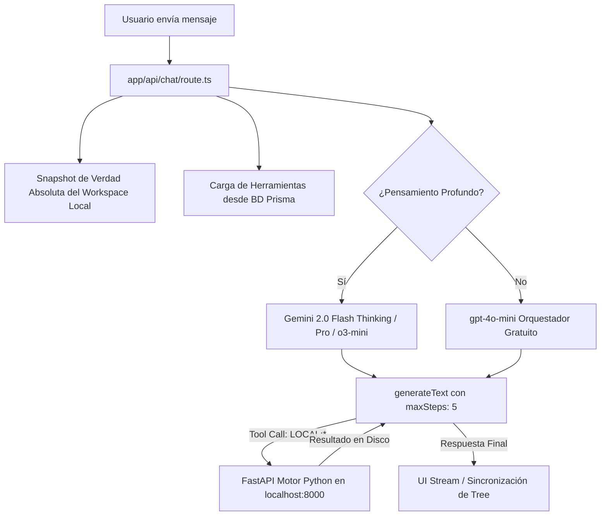

# ⚙️ Ficha Técnica: Agentic Orchestrator & Tool Execution Loop

> **Ruta:** `docs/features/agentic_orchestrator/ficha_tecnica.md`  
> **Estado:** `✅ HECHO` (En producción / Operativo)  
> **Capa Técnica:** Next.js API Routes (`/api/chat`) + Vercel AI SDK (`generateText`) + Prisma + Motor Python Local

---

## 🛠️ 1. Pipeline de Ejecución Agéntica (Tool Loop)

---

## 🔌 2. Capacidades Técnicas del Endpoint `/api/chat`

1. **Snapshot en Tiempo Real del Workspace:**
   - Antes de enviar el prompt al LLM, escanea el directorio local para inyectar carpetas y archivos reales, evitando alucinaciones de rutas inexistentes.
2. **Traducción Dinámica de Schemas JSON a Zod:**
   - Lee definiciones de herramientas desde la tabla `Tool` de Prisma y las adapta al vuelo usando `jsonSchema` de `ai-core`.
3. **Loop Multi-Paso (`maxSteps: 5`):**
   - Permite que el modelo encadene hasta 5 operaciones consecutivas (ej: `consultar_prompts` para cargar SOPs de creación de canales o videos $\to$ verificar workspace $\to$ ejecutar `crear_carpetas` $\to$ generar metadatos $\to$ responder).
4. **Carga Dinámica de SOPs y Taxonomía (`consultar_prompts`):**
   - El orquestador ya no almacena directivas extensas hardcodeadas en TypeScript. Consulta dinámicamente plantillas maestras y esquemas de carpetas desde la tabla `PromptTemplate` a través de la herramienta `/api/tools/prompts`.
5. **Sincronización Bidireccional (`workspaceModified`):**
   - Si una herramienta altera el sistema de archivos, el endpoint emite la señal para que el componente `FileTree.tsx` recargue automáticamente el árbol de archivos.
6. **Modo Pensamiento Profundo (Deep Reasoning):**
   - Enrutamiento a modelos de razonamiento riguroso con inyección de reglas de retención y psicología de audiencia.

---

## 📂 3. Archivos Involucrados

- [`app/api/chat/route.ts`](file:///e:/autoprod/app/api/chat/route.ts): Endpoint central del orquestador.
- [`app/api/tools/prompts/route.ts`](file:///e:/autoprod/app/api/tools/prompts/route.ts): Herramienta `consultar_prompts` para SOPs dinámicos.
- [`migrations/003_baseline_orchestrator_and_prompts.sql`](file:///e:/autoprod/migrations/003_baseline_orchestrator_and_prompts.sql): Migración SQL declarativa de infraestructura y prompts.
- [`components/dashboard/ChatPanel.tsx`](file:///e:/autoprod/components/dashboard/ChatPanel.tsx): Panel de chat conectado a plantillas dinámicas de BD.
- [`prisma/schema.prisma`](file:///e:/autoprod/prisma/schema.prisma): Modelos `Agent`, `Tool`, `AgentTool` y `PromptTemplate`.
