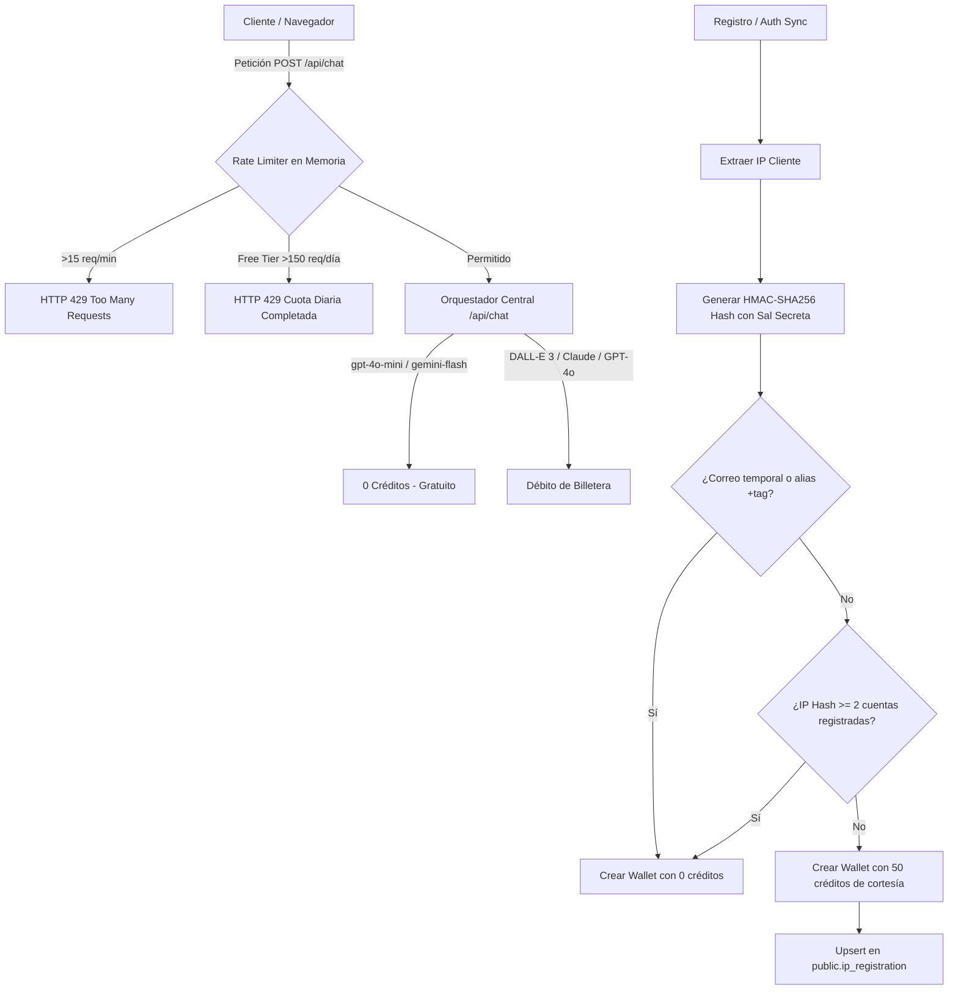

# 🛡️ Ficha Técnica: Sistema Anti-Abuso, Rate Limiting y Hashing HMAC-SHA256

> **Módulo:** Anti-Abuse, Rate Limiter & Token Protection  
> **Estado:** `✅ HECHO`  
> **Ubicación Principal:** [`lib/anti-abuse.ts`](file:///e:/autoprod/lib/anti-abuse.ts), [`lib/rate-limit.ts`](file:///e:/autoprod/lib/rate-limit.ts), [`lib/pricing-config.ts`](file:///e:/autoprod/lib/pricing-config.ts)

---

## 📌 Resumen de Arquitectura

El sistema protege la infraestructura de AutoProd contra ataques de denegación de servicio (DoS), scripts automatizados y granjas de multicuentas que buscan explotar los 50 créditos de bienvenida del plan de prueba gratuito (`FREE`), mientras libera el chat base del orquestador (`gpt-4o-mini`) a costo cero para permitir que los créditos de prueba se utilicen en la producción audiovisual completa (miniaturas con DALL-E 3, transcripciones Whisper, etc.).



---

## 🧱 Componentes Técnicos

### 1. `lib/anti-abuse.ts`
* **`getClientIp(reqOrHeaders)`**: Detección segura de IP del cliente con soporte para Cloudflare (`cf-connecting-ip`), proxies reversos (`x-forwarded-for`) e IP directa (`x-real-ip`).
* **`getSecureIpHash(ip)`**: Generación de hash criptográfico `HMAC-SHA256` utilizando `IP_HASH_SECRET` o `SUPABASE_SERVICE_ROLE_KEY` como sal secreta. Cumple con normativas de privacidad (GDPR) ya que la IP real nunca se almacena en texto plano.
* **`normalizeEmail(email)`**: Remueve alias con el truco del `+` (ej: `juan+1@gmail.com` -> `juan@gmail.com`).
* **`isDisposableEmail(email)`**: Validador contra lista negra de 25+ dominios de correos temporales (`yopmail`, `10minutemail`, `tempmail`, `guerrillamail`, etc.).
* **`evaluateWelcomeBonusEligibility(email, clientIp, dbClient)`**: Verifica si la cuenta califica para el bono de bienvenida (máximo 2 cuentas por hash de IP).
* **`recordIpBonusGranted(ipHash, dbClient)`**: Incrementa el contador en `public.ip_registration`.

### 2. `lib/rate-limit.ts`
* **`checkChatRateLimit(req, userId, isFreeTier)`**:
  * **Límite de Ráfaga:** 15 solicitudes por minuto por usuario/IP.
  * **Cuota Diaria:** 150 mensajes diarios para cuentas con plan `FREE`.
  * **Auto-Purga:** Recolección periódica de memoria RAM cada 5 minutos para evitar fugas.
* **`attachRateLimitHeaders(headers, result)`**: Inyecta cabeceras estándar HTTP `X-RateLimit-Limit`, `X-RateLimit-Remaining`, `X-RateLimit-Reset` y `Retry-After`.

### 3. `lib/pricing-config.ts`
* **`isOrchestratorFreeForUser(userPlanName, modelName)`**:
  * Devuelve `true` para `gpt-4o-mini`, `gemini-1.5-flash` o `default` para todos los usuarios.
  * Los 50 créditos de cortesía quedan reservados exclusivamente para herramientas pesadas (generación de imágenes DALL-E 3, modelos pesados como Claude o GPT-4o, y Whisper Cloud).

### 4. Base de Datos (`migrations/004_ip_registration_and_anti_abuse.sql`)
```sql
CREATE TABLE IF NOT EXISTS public.ip_registration (
    id UUID PRIMARY KEY DEFAULT gen_random_uuid(),
    ip_hash TEXT UNIQUE NOT NULL,
    account_count INT DEFAULT 1 NOT NULL,
    created_at TIMESTAMPTZ DEFAULT NOW() NOT NULL,
    updated_at TIMESTAMPTZ DEFAULT NOW() NOT NULL
);
CREATE INDEX IF NOT EXISTS idx_ip_registration_hash ON public.ip_registration(ip_hash);
```

---

## 📡 Endpoints Modificados

| Endpoint | Modificación |
|---|---|
| `POST /api/chat` | Integración de `checkChatRateLimit` (HTTP 429), cabeceras de rate limit y orquestador base a 0 créditos. |
| `POST /api/auth/sync` | Evaluación de elegibilidad para bono de 50 créditos mediante HMAC-SHA256 de IP y filtro de correos desechables. |
