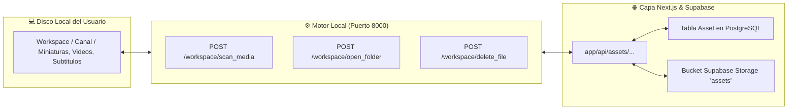

# ⚙️ Ficha Técnica: Biblioteca de Recursos (Asset Library & CRUD)

> **Ruta:** `docs/features/asset_library/ficha_tecnica.md`  
> **Estado:** `✅ HECHO` (En producción / Operativo)  
> **Capa Técnica:** Next.js API Routes + Prisma (PostgreSQL) + Supabase Storage + FastAPI Motor Local

---

## 🛠️ 1. Arquitectura de Almacenamiento Dual

---

## 🗄️ 2. Modelo de Datos Prisma (`Asset`)

- `id`: UUID.
- `userId`: Relación con `User`.
- `channelId`: Relación opcional con `Channel`.
- `name`: Nombre físico del archivo.
- `type`: Enum (`IMAGE`, `THUMBNAIL`, `SUBTITLE`, `VIDEO`, `AUDIO`, `OTHER`).
- `format`: Extensión (`png`, `srt`, `mp4`, etc.).
- `prompt`: Prompt textual utilizado para la generación con IA.
- `storageUrl`: URL pública en Supabase Storage (bucket `assets`).
- `localPath`: Ruta física absoluta en el disco del usuario.
- `sizeBytes`: Tamaño exacto del archivo en bytes.
- `metadata`: Objeto JSON con resolución, duración, etc.

---

## 🔌 3. Endpoints Clave

| Endpoint | Método | Descripción |
|---|:---:|---|
| `/api/assets` | `GET` | Lista recursos con filtros de tipo, canal, búsqueda y cálculo de cuota de almacenamiento. |
| `/api/assets` | `POST` | Registra un nuevo asset en la base de datos. |
| `/api/assets/[id]` | `PATCH` / `DELETE` | Renombrado o eliminación segura (con purga opcional del disco local). |
| `/api/assets/scan-local` | `POST` | Invoca el motor de Python para auto-indexar archivos físicos sin duplicados. |
| `/api/assets/[id]/upload-to-cloud` | `POST` | Respalda un archivo local en el bucket de Supabase Storage. |
| `/workspace/scan_media` | `POST` (FastAPI) | Escanea recursivamente carpetas locales clasificando por extensión y peso. |
| `/workspace/open_folder` | `POST` (FastAPI) | Abre el Explorador de Windows o Finder resaltando el archivo seleccionado. |

---

## 📂 4. Archivos Involucrados

- [`app/api/assets/route.ts`](file:///e:/autoprod/app/api/assets/route.ts): API principal de recursos.
- [`app/api/assets/scan-local/route.ts`](file:///e:/autoprod/app/api/assets/scan-local/route.ts): Sincronización con disco.
- [`controlador/routers/workspace.py`](file:///e:/autoprod/controlador/routers/workspace.py): Operaciones de archivos locales y apertura en explorador nativo.
- [`components/dashboard/AssetLibraryView.tsx`](file:///e:/autoprod/components/dashboard/AssetLibraryView.tsx): Interfaz de usuario con alternador de cuadrícula/tabla y medidor de cuota.
