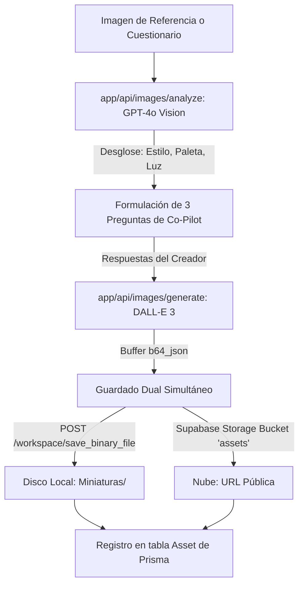

# ⚙️ Ficha Técnica: Image & Thumbnail Studio

> **Ruta:** `docs/features/image_generator/ficha_tecnica.md`  
> **Estado:** `✅ HECHO` (En producción / Operativo)  
> **Capa Técnica:** Next.js API Routes + DALL-E 3 + OpenAI Vision + Supabase Storage + FastAPI Motor Local

---

## 🛠️ 1. Pipeline de Análisis Visual y Generación Dual

---

## 🔌 2. Endpoints de la API

| Endpoint | Método | Parámetros Clave | Descripción |
|---|:---:|---|---|
| `/api/images/analyze` | `POST` | `{ imageBase64 }` | Análisis de estilo con visión multimodal y sugerencia de preguntas guía. |
| `/api/images/generate` | `POST` | `{ prompt, aspectRatio, channelId, workspacePath }` | Genera imagen con DALL-E 3, guarda en disco local y respalda en Supabase. |
| `/workspace/save_binary_file` | `POST` (FastAPI) | `{ file_path, content_base64 }` | Escribe los bytes físicos de la imagen en la carpeta del canal. |

---

## 🎛️ 3. Especificaciones de Relación de Aspecto en DALL-E 3

- **YouTube Miniatura (16:9):** Resolución `1792x1024`.
- **Shorts / Reels / TikTok (9:16):** Resolución `1024x1792`.
- **Cuadrado / Portada (1:1):** Resolución `1024x1024`.

---

## 📂 4. Archivos Involucrados

- [`app/api/images/analyze/route.ts`](file:///e:/autoprod/app/api/images/analyze/route.ts): Endpoint de análisis visual.
- [`app/api/images/generate/route.ts`](file:///e:/autoprod/app/api/images/generate/route.ts): Endpoint de generación y persistencia dual.
- [`controlador/routers/workspace.py`](file:///e:/autoprod/controlador/routers/workspace.py): Guardado físico en disco duro.
- [`components/dashboard/ImageStudio.tsx`](file:///e:/autoprod/components/dashboard/ImageStudio.tsx): Interfaz de creación interactiva con soporte `Ctrl+V`.
