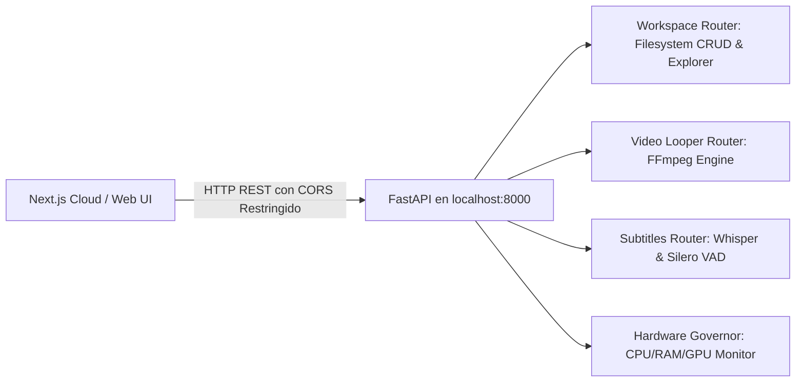

# ⚙️ Ficha Técnica: Motor Local (FastAPI Python `localhost:8000`)

> **Ruta:** `docs/features/local_motor/ficha_tecnica.md`  
> **Estado:** `✅ HECHO` (En producción / Operativo)  
> **Capa Técnica:** Python 3.10+ + FastAPI + Uvicorn + Subprocess OS

---

## 🛠️ 1. Arquitectura y Puentes de Comunicación

---

## 🔌 2. Configuración de Red, CORS y Routers

- **Host & Puerto:** `127.0.0.1:8000` (Uvicorn).
- **Inyección Automática de Binarios:** Al arrancar, `main.py` añade la subcarpeta `bin/` (`ffmpeg`, `yt-dlp`) al `PATH` de entorno.
- **Orígenes Permitidos (CORS):** Universal (`*`), permitiendo conexión fluida desde cualquier dominio de AutoProd (producción o desarrollo).
- **Routers Registrados en `main.py`:**
  - `/workspace`: Operaciones de directorios, lectura/escritura y selección nativa.
  - `/video`: Inspección de medios, escaneo de audio y render FFmpeg.
  - `/subtitles`: Estimación y transcripción con Whisper.
  - `/ollama`: Gestor e instalador automático de Ollama local.

---

## 🔒 3. Disponibilidad y Accesibilidad

- **Plan Free (Trial) y Planes de Pago (Starter, Pro, Enterprise):** Acceso 100% habilitado para la descarga e instalación del Motor Local. Al correr en la máquina del usuario, AutoProd asume **costo cero de cómputo** mientras el creador experimenta máxima velocidad y soberanía de archivos.

---

## 📦 4. Instalador Automático de 1-Clic (`autoprod-setup`)

- **Windows:** [`scripts/installer/install-windows.bat`](file:///e:/autoprod/scripts/installer/install-windows.bat) — Abre `FolderBrowserDialog` nativo, crea carpetas (`bin`, `motor`, `workspace`), descarga `ffmpeg.exe` y `yt-dlp.exe`, crea `venv` y lanza `start_motor.bat`.
- **macOS:** [`scripts/installer/install-macos.sh`](file:///e:/autoprod/scripts/installer/install-macos.sh) — Selector nativo de Finder vía AppleScript, soporte universal/Apple Silicon, descarga de binarios y genera `start_motor.sh`.
- **Endpoint de Descarga:** [`app/api/setup/download-installer/route.ts`](file:///e:/autoprod/app/api/setup/download-installer/route.ts) con detección automática del SO del cliente.

---

## 📂 5. Archivos Involucrados

- [`controlador/main.py`](file:///e:/autoprod/controlador/main.py): Entrada de Uvicorn, configuración de CORS, inyección de PATH y montaje de routers.
- [`controlador/routers/workspace.py`](file:///e:/autoprod/controlador/routers/workspace.py): CRUD y lectura dinámica de `.autoprod-config.json`.
- [`controlador/routers/video_looper.py`](file:///e:/autoprod/controlador/routers/video_looper.py): Procesamiento FFmpeg.
- [`controlador/routers/subtitles.py`](file:///e:/autoprod/controlador/routers/subtitles.py): Transcripción de audio.
- [`lib/controlador-client.ts`](file:///e:/autoprod/lib/controlador-client.ts): Conector HTTP TypeScript cliente.
- [`scripts/installer/install-windows.bat`](file:///e:/autoprod/scripts/installer/install-windows.bat): Instalador Windows.
- [`scripts/installer/install-macos.sh`](file:///e:/autoprod/scripts/installer/install-macos.sh): Instalador macOS.

