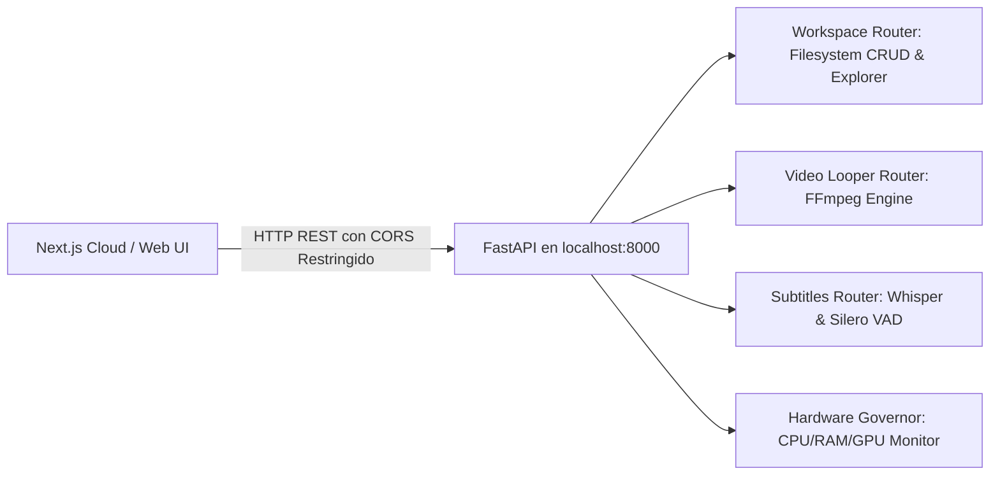

# ⚙️ Ficha Técnica: Motor Local (FastAPI Python `localhost:8000`)

> **Ruta:** `docs/features/local_motor/ficha_tecnica.md`  
> **Estado:** `✅ HECHO` (En producción / Operativo)  
> **Capa Técnica:** Python 3.10+ + FastAPI + Uvicorn + Subprocess OS

---

## 🛠️ 1. Arquitectura y Puentes de Comunicación

---

## 🔌 2. Configuración de Red, CORS y Routers

- **Host & Puerto:** `127.0.0.1:8000` (Uvicorn).
- **Orígenes Permitidos (CORS):**
  - `http://localhost:3000`
  - `http://127.0.0.1:3000`
  - `https://autoprod.vercel.app` (Dominio de producción).
- **Routers Registrados en `main.py`:**
  - `/workspace`: Operaciones de directorios, lectura/escritura y selección nativa.
  - `/video`: Inspección de medios, escaneo de audio y render FFmpeg.
  - `/subtitles`: Estimación y transcripción con Whisper.
  - `/ollama`: Gestor e instalador automático de Ollama local.

---

## 🔒 3. Control de Acceso por Nivel de Suscripción

- **Plan Free (Trial):** Acceso denegado a la descarga e instalación automatizada del helper (`/api/setup/install` responde `403 requiresUpgrade: true`).
- **Starter ($70), Pro ($100), Enterprise ($150):** Acceso total al instalador de dependencias, scripts de Python y aceleración por GPU local.

---

## 📂 4. Archivos Involucrados

- [`controlador/main.py`](file:///e:/autoprod/controlador/main.py): Entrada de Uvicorn, configuración de CORS y montaje de routers.
- [`controlador/routers/workspace.py`](file:///e:/autoprod/controlador/routers/workspace.py): CRUD y llamadas a diálogos nativos del SO.
- [`controlador/routers/video_looper.py`](file:///e:/autoprod/controlador/routers/video_looper.py): Procesamiento FFmpeg.
- [`controlador/routers/subtitles.py`](file:///e:/autoprod/controlador/routers/subtitles.py): Transcripción de audio.
- [`lib/controlador-client.ts`](file:///e:/autoprod/lib/controlador-client.ts): Conector HTTP TypeScript cliente.
