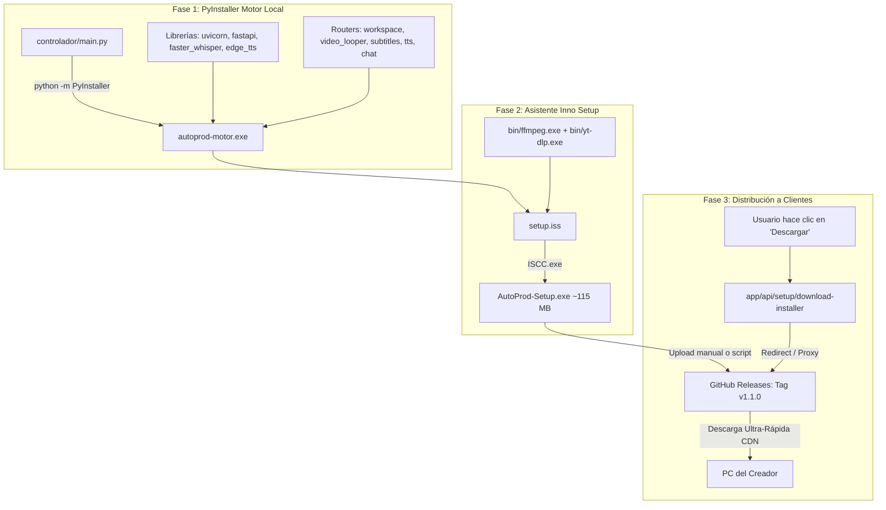

# ⚙️ Ficha Técnica: Instalador Autónomo & Empaquetado (`AutoProd-Setup.exe`)

> **Ruta:** `docs/features/standalone_installer/ficha_tecnica.md`  
> **Estado:** `✅ HECHO (Windows: AutoProd-Setup.exe)` \| `📋 PLANIFICADO (macOS: AutoProd-Setup.dmg)`  
> **Capa Técnica:** PyInstaller (One-File) + Inno Setup 6 + Binarios Portables + GitHub Releases CDN + Next.js API Routes

---

## 🛠️ 1. Pipeline de Compilación & Empaquetado



---

## 🔌 2. Endpoints y Automatización del Harness

### A. Endpoint de Descarga Oficial

| Endpoint | Método | Parámetros Clave | Descripción |
|---|:---:|---|---|
| `/api/setup/download-installer` | `GET` | `os?: 'windows' \| 'mac'` | Sirve el instalador oficial. Consulta automáticamente la última release pública en GitHub (`/releases/latest/download/AutoProd-Setup.exe`) con fallback al binario local en `dist/`. |

### B. Comando Oficial de Compilación

```bash
pnpm build:exe
```
* **Script:** [`harness/build/compile-exe.ts`](file:///e:/autoprod/harness/build/compile-exe.ts)
* **Acciones:**
  1. Cierra instancias activas de `autoprod-motor.exe` vía `taskkill` para liberar bloqueos.
  2. Actualiza dependencias de `requirements.txt` en el entorno de Python.
  3. Ejecuta PyInstaller con las directivas `--collect-all` y `--hidden-import` requeridas.
  4. Deposita el ejecutable listo en `dist/autoprod-motor.exe`.

---

## 🎛️ 3. Especificaciones del Script de Instalación (`setup.iss`)

Ubicado en [`scripts/installer/windows/setup.iss`](file:///e:/autoprod/scripts/installer/windows/setup.iss):

1. **Directorio por Defecto:**
   - `{autopf}\AutoProdAI` (habitualmente `C:\Users\{Usuario}\AppData\Local\Programs\AutoProdAI` o `C:\Program Files\AutoProdAI`).
2. **Estructura Creada en la Máquina del Cliente:**
   ```
   📁 AutoProdAI/
   ├── 📄 autoprod-motor.exe        <-- Binario autónomo del motor FastAPI
   ├── 📄 .autoprod-config.json     <-- Configuración generada en ssPostInstall
   ├── 📁 bin/
   │   ├── ffmpeg.exe               <-- Motor de render y transcodificación
   │   ├── ffprobe.exe              <-- Inspector de medios
   │   └── yt-dlp.exe               <-- Extractor de medios y referencias
   └── 📁 workspace/                <-- Espacio de trabajo canónico persistente
   ```
3. **Rutina Pascal `ssPostInstall`:**
   Genera automáticamente el archivo `.autoprod-config.json` fijando:
   ```json
   {
     "basePath": "{app}\\workspace"
   }
   ```
4. **Preservación de Datos:**
   Durante una actualización o desinstalación, la carpeta `workspace/` no se elimina, garantizando que el usuario conserve todos sus canales y proyectos.

---

## 📂 4. Archivos Involucrados

- [`scripts/installer/windows/setup.iss`](file:///e:/autoprod/scripts/installer/windows/setup.iss): Definición formal del instalador de Windows.
- [`scripts/build/build-windows.bat`](file:///e:/autoprod/scripts/build/build-windows.bat): Script batch de compilación completa.
- [`harness/build/compile-exe.ts`](file:///e:/autoprod/harness/build/compile-exe.ts): Arnés oficial en TypeScript (`pnpm build:exe`).
- [`app/api/setup/download-installer/route.ts`](file:///e:/autoprod/app/api/setup/download-installer/route.ts): Endpoint de entrega directa y streaming CDN.
- [`controlador/main.py`](file:///e:/autoprod/controlador/main.py): Manejo de ejecución en modo binario congelado (`getattr(sys, 'frozen', False)`).
