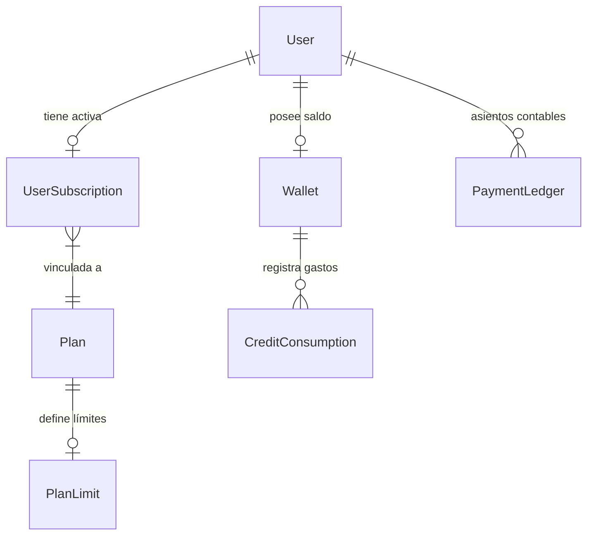

# ⚙️ Ficha Técnica: Subscriptions, Billing & Token Economics

> **Ruta:** `docs/features/subscriptions_and_billing/ficha_tecnica.md`  
> **Estado:** `✅ HECHO` (En producción / Operativo)  
> **Capa Técnica:** Next.js API Routes + Prisma (adapter-pg) + Lemon Squeezy SDK + Supabase PostgreSQL

---

## 🛠️ 1. Arquitectura de Datos y Modelos Prisma

### Modelos Centrales en PostgreSQL:
- **`Plan`:** Catálogo de planes (`FREE`, `STARTER`, `PRO`, `ENTERPRISE`) con `monthlyPriceUsd` e identificadores de pasarela.
- **`PlanLimit`:** Restricciones de negocio (`maxChannels`, `maxVideosPerChannel`, `canRenderInCloud`, `hasAdvancedTemplates`).
- **`UserSubscription`:** Estado de suscripción (`ACTIVE`, `CANCELLED`, `EXPIRED`), fechas de ciclo y referencia a Lemon Squeezy.
- **`Wallet`:** Balance de créditos (1 USD = 100 créditos) para modelos pesados y consumos cloud.
- **`CreditConsumption` & `PaymentLedger`:** Trazabilidad inmutable de débitos y créditos con comisiones.

---

## 🔌 2. Endpoints de la Capa de Monetización

| Endpoint | Método | Descripción |
|---|:---:|---|
| `/api/payments/checkout` | `POST` | Genera la sesión de checkout alojada en Lemon Squeezy con `user_id` y `plan_name`. |
| `/api/webhooks/lemonsqueezy` | `POST` | Valida la firma HMAC `X-Signature`, renueva fechas de suscripción e incrementa créditos. |
| `/api/user/wallet` | `GET` | Devuelve el balance actual de créditos y el desglose de consumo del usuario. |
| `/api/admin/users/manual-subscription` | `POST` | Activación manual para pagos Nequi/Bancolombia con cálculo automático de comisiones. |
| `/api/admin/pricing` | `GET` / `POST` | Gestión dinámica de las tarifas de modelos de IA en `ServicePricing`. |

---

## ⚖️ 3. Reglas de Validación y Consumo Atómico

1. **AutoProd Brain™ Gratuito para Planes Pagos:**
   - Evaluado en [`lib/pricing-config.ts`](file:///e:/autoprod/lib/pricing-config.ts) mediante `isOrchestratorFreeForUser()`.
   - Para planes `STARTER`, `PRO` y `ENTERPRISE`, las llamadas con `gpt-4o-mini` descuentan **0 créditos**.
   - Para plan `FREE`, descuenta **1 crédito** por interacción para mitigar abuso.
2. **Respuesta HTTP 402 Payment Required:**
   - Si el usuario solicita un modelo pesado (ej. GPT-4o, Claude 3.5 Sonnet) sin saldo suficiente en su `Wallet`, `/api/chat` responde `402`, disparando reactivamente el modal [`SubscriptionPlansModal.tsx`](file:///e:/autoprod/components/dashboard/SubscriptionPlansModal.tsx).
3. **Bloqueo Físico de Descarga del Motor Local:**
   - La descarga del instalador del motor de Python está restringida a usuarios con plan activo $\ge$ `STARTER`.

---

## 📂 4. Archivos Involucrados

- [`lib/pricing-config.ts`](file:///e:/autoprod/lib/pricing-config.ts): Lógica central de pricing, créditos y exenciones.
- [`app/api/payments/checkout/route.ts`](file:///e:/autoprod/app/api/payments/checkout/route.ts): Endpoint de checkout Lemon Squeezy.
- [`app/api/webhooks/lemonsqueezy/route.ts`](file:///e:/autoprod/app/api/webhooks/lemonsqueezy/route.ts): Webhook handler con validación criptográfica.
- [`app/api/admin/users/manual-subscription/route.ts`](file:///e:/autoprod/app/api/admin/users/manual-subscription/route.ts): Activación manual Nequi.
- [`components/dashboard/SubscriptionPlansModal.tsx`](file:///e:/autoprod/components/dashboard/SubscriptionPlansModal.tsx): Modal de planes y pasarela dual.
- [`components/dashboard/CreditCounter.tsx`](file:///e:/autoprod/components/dashboard/CreditCounter.tsx): Widget de balance de créditos en vivo.
