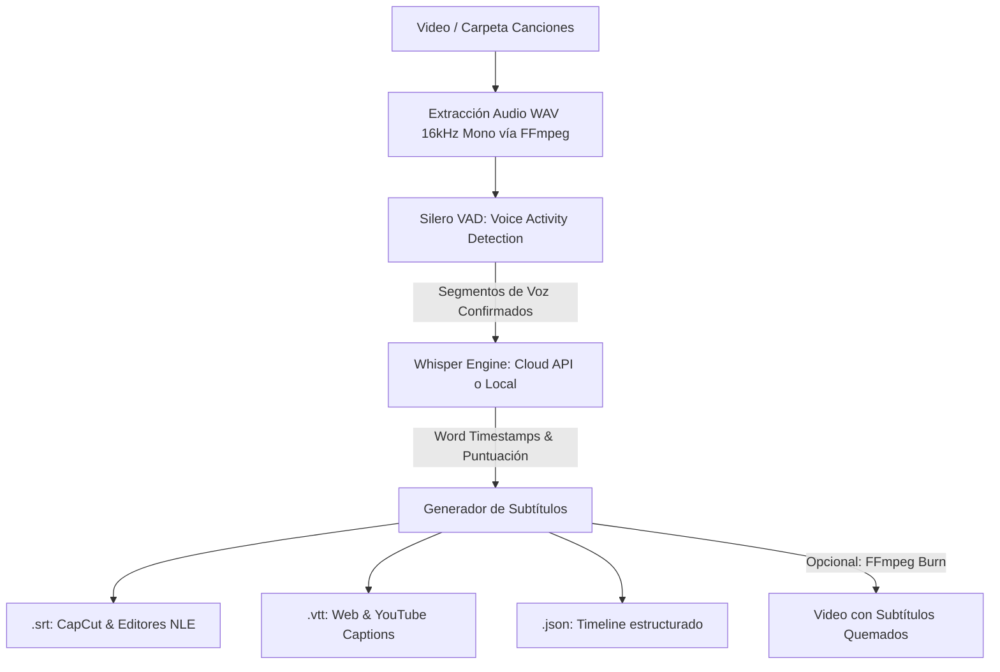

# ⚙️ Ficha Técnica: Subtitulador Whisper & Hardware Governor

> **Ruta:** `docs/features/subtitles_whisper/ficha_tecnica.md`  
> **Estado:** `✅ HECHO` (En producción / Operativo)  
> **Capa Técnica:** Python FastAPI (Puerto 8000) + Whisper (OpenAI / Local) + Silero VAD + FFmpeg + Next.js

---

## 🛠️ 1. Pipeline de Procesamiento de Audio & Transcripción

---

## 🔌 2. Endpoints de la API Local (`localhost:8000`)

| Endpoint | Método | Parámetros Clave | Descripción |
|---|:---:|---|---|
| `/subtitles/estimate` | `POST` | `{ file_path, is_folder, engine }` | Evalúa la duración total del audio y el hardware disponible para estimar tiempo de ejecución. |
| `/subtitles/generate` | `POST` | `{ file_path, is_folder, engine, language, burn_in }` | Inicia el pipeline de extracción, Whisper y guardado de archivos. |
| `/subtitles/status/{job_id}` | `GET` | `job_id` en path | Emite el progreso en tiempo real (`percentage`, `current_file`, `status`). |
| `/subtitles/content` | `GET` | `{ srt_path }` | Lee el contenido de un archivo `.srt` para renderizarlo en el editor web. |
| `/subtitles/save` | `POST` | `{ srt_path, content }` | Guarda modificaciones manuales de texto o marcas de tiempo realizadas en la UI. |

---

## ⚡ 3. Hardware Governor & Políticas de Recursos

Implementado en [`controlador/hardware.py`](file:///e:/autoprod/controlador/hardware.py):
1. **Detección de Entorno:**
   - Núcleos de CPU vía `os.cpu_count()`.
   - Memoria RAM total y disponible vía API nativa de Windows `GlobalMemoryStatusEx` (`ctypes`).
   - Aceleradores GPU disponibles (NVIDIA CUDA / DirectML).
2. **Aislamiento de Hilos:**
   - Límite de núcleos de CPU para Whisper Local: $\max(1, \text{cpu\_cores} - 2)$. Esto evita que el navegador o el SO se congelen durante la transcripción.
3. **Semáforo de Exclusión Mutua:**
   - Impide que un render de Video Looper y una transcripción pesada de Whisper se ejecuten al mismo tiempo, encolándolos en memoria.

---

## 📂 4. Archivos Involucrados

- [`controlador/hardware.py`](file:///e:/autoprod/controlador/hardware.py): Detección de CPU, RAM, GPU y estimación de tiempos.
- [`controlador/routers/subtitles.py`](file:///e:/autoprod/controlador/routers/subtitles.py): Rutas de FastAPI para estimación y transcripción.
- [`lib/controlador-client.ts`](file:///e:/autoprod/lib/controlador-client.ts): Métodos TypeScript (`estimateSubtitles`, `generateSubtitles`, `getSubtitlesStatus`).
- [`components/dashboard/PreExecutionEstimateModal.tsx`](file:///e:/autoprod/components/dashboard/PreExecutionEstimateModal.tsx): Modal con diagnósticos de hardware antes de ejecutar.
- [`components/dashboard/VideoSubtitlesStudio.tsx`](file:///e:/autoprod/components/dashboard/VideoSubtitlesStudio.tsx): Interfaz de subtitulado individual y por carpetas con editor integrado.
