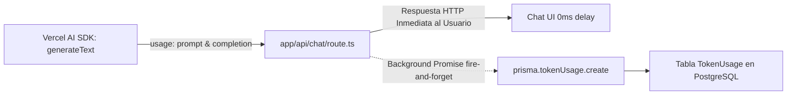

# ⚙️ Ficha Técnica: Token Tracker & Auditoría de Consumo

> **Ruta:** `docs/features/token_tracker/ficha_tecnica.md`  
> **Estado:** `✅ HECHO` (En producción / Operativo)  
> **Capa Técnica:** Next.js API Routes + Vercel AI SDK (`usage`) + Prisma + Supabase PostgreSQL

---

## 🛠️ 1. Pipeline de Rastreo Asíncrono (Fire-and-Forget)

---

## 🗄️ 2. Modelo de Datos Prisma (`TokenUsage`)

- `id`: UUID.
- `userId`: Relación con `User`.
- `conversationId`: Relación opcional con `Conversation`.
- `provider`: Enum / String (`openai`, `gemini`, `anthropic`, `ollama`).
- `modelName`: Nombre exacto del modelo (`gpt-4o-mini`, `gemini-1.5-flash`, etc.).
- `promptTokens`: Cantidad de tokens en la entrada (contexto, reglas, historial).
- `completionTokens`: Cantidad de tokens generados en la respuesta.
- `totalTokens`: Suma de entrada y salida.
- `createdAt`: Timestamp del consumo.

---

## 📂 3. Archivos Involucrados

- [`prisma/schema.prisma`](file:///e:/autoprod/prisma/schema.prisma): Modelo `TokenUsage` con índices por usuario y fecha.
- [`app/api/chat/route.ts`](file:///e:/autoprod/app/api/chat/route.ts): Intercepción del objeto `usage` tras finalizar `generateText`.
- [`app/admin/page.tsx`](file:///e:/autoprod/app/admin/page.tsx): Visualización de métricas de tokens consumidos por usuario.
