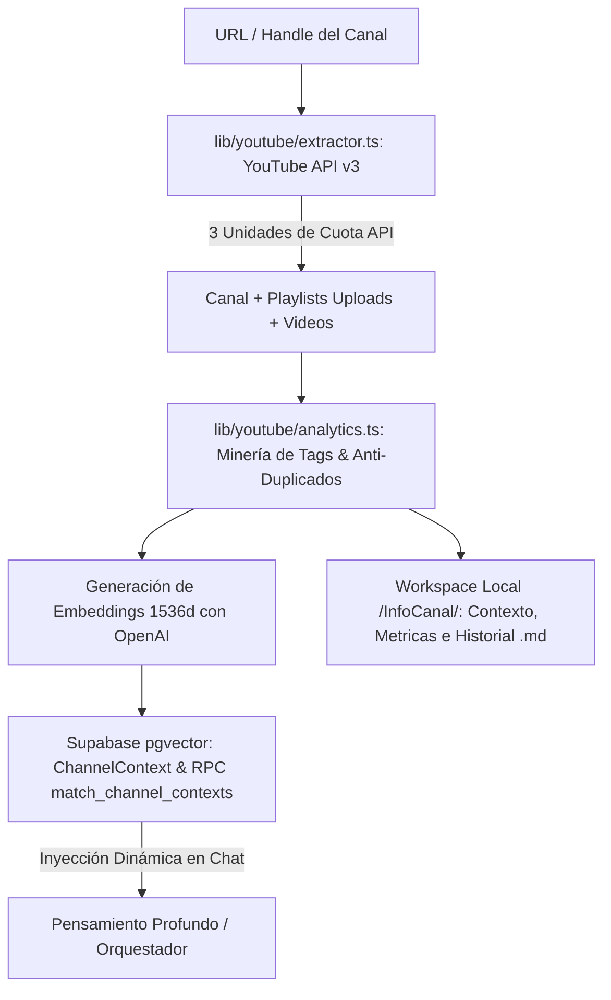

# ⚙️ Ficha Técnica: YouTube Channel Extractor & pgvector Context

> **Ruta:** `docs/features/youtube_channel_extractor/ficha_tecnica.md`  
> **Estado:** `✅ HECHO` (En producción / Operativo)  
> **Capa Técnica:** Next.js + YouTube Data API v3 + OpenAI Embeddings (`text-embedding-3-small`) + Supabase pgvector + Prisma

---

## 🛠️ 1. Pipeline de Extracción y Persistencia Semántica

---

## 🗄️ 2. Modelo de Base de Datos y Búsqueda Vectorial

- **Tabla `ChannelContext` (`prisma/schema.prisma`):**
  - `id`: UUID.
  - `channelId`: Relación 1-1 con `Channel`.
  - `summary`: Resumen semántico del estilo, nicho y voz del canal.
  - `topTags`: Array de etiquetas comprobadas de alto rendimiento.
  - `publishedTitles`: Catálogo de títulos históricos para evitar duplicación.
- **pgvector & RPC (`migrations/add_channel_context_vector.sql`):**
  - Columna `embedding vector(1536)`.
  - Índice HNSW (`vector_cosine_ops`) para búsqueda ultrarrápida por similitud de coseno.
  - Función RPC `match_channel_contexts(query_embedding, match_threshold, match_count)`.

---

## 🔌 3. Endpoints y Herramienta Agéntica

| Endpoint / Tool | Método | Descripción |
|---|:---:|---|
| `/api/tools/extraer_canal_youtube` | `POST` | Invoca la extracción completa de canal, generación de embeddings y persistencia dual. |
| Tool `extraer_canal_youtube` | Agente | Tool registrada en el catálogo de Gemini/GPT para autoejecutar la extracción si el usuario envía un link de YouTube en el chat. |

---

## 📂 4. Archivos Involucrados

- [`lib/youtube/extractor.ts`](file:///e:/autoprod/lib/youtube/extractor.ts): Resolución de handles/URLs y llamadas a YouTube Data API v3.
- [`lib/youtube/analytics.ts`](file:///e:/autoprod/lib/youtube/analytics.ts): Algoritmos de minería de tags, engagement y síntesis.
- [`app/api/tools/extraer_canal_youtube/route.ts`](file:///e:/autoprod/app/api/tools/extraer_canal_youtube/route.ts): Endpoint de la herramienta.
- [`migrations/add_channel_context_vector.sql`](file:///e:/autoprod/migrations/add_channel_context_vector.sql): Definición SQL de pgvector y RPC.
- [`components/dashboard/Launchpad.tsx`](file:///e:/autoprod/components/dashboard/Launchpad.tsx): Tarjeta de extracción en 1 clic.
- [`tests/youtube-extractor.test.ts`](file:///e:/autoprod/tests/youtube-extractor.test.ts): Pruebas de extracción y normalización.
