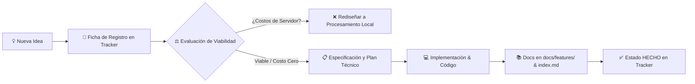

# 🎯 Matriz de Control de Alcance, Funcionalidades e Ideas de Escalabilidad
## AutoProd Production IDE — Master Feature Tracker & Product Backlog

> **Versión del Tracker:** 1.0.0  
> **Última actualización:** 2026-09-07  
> **Arquitectura:** Híbrida Descentralizada (Next.js Cloud + FastAPI Motor Local `localhost:8000` + Supabase/Prisma)  
> **Filosofía de Escalabilidad:** Minimización de costos de servidor ($0 infra innecesaria), procesamiento pesado en el cliente (GPU/CPU local), BYOK + cuota gratuita optimizada en IA.

---

## 📌 1. Guía de Convenciones y Estados

Para mantener un seguimiento estricto, uniforme y sin ambigüedades entre el equipo y los agentes de IA, cada funcionalidad o idea utiliza las siguientes etiquetas:

### 🏷️ Estados de Desarrollo
| Estado | Icono | Definición |
|---|:---:|---|
| **Hecho** | `✅ HECHO` | Implementado, funcional, integrado con frontend/backend y probado. |
| **En Progreso** | `🔄 EN PROGRESO` | En desarrollo activo o refactorización técnica en curso. |
| **Planificado** | `📋 PLANIFICADO` | Alcance y arquitectura definidos; listo para sprint inmediato. |
| **Idea / Backlog** | `💡 IDEA` | Concepto propuesto en evaluación de viabilidad y ROI técnico. |
| **En Pausa / Descartado** | `⏸️ EN PAUSA` | Pospuesto temporalmente o descartado por costos/complejidad. |

### ⚡ Prioridad & Esfuerzo
- **Prioridad:**
  - `P0 (Crítica)`: Imprescindible para el core business, monetización o estabilidad.
  - `P1 (Alta)`: Alto valor percibido por el creador; siguiente bloque a construir.
  - `P2 (Media)`: Mejora la experiencia, retención y automatización avanzada.
  - `P3 (Baja / Futuro)`: Diferenciador o visión de largo plazo.
- **Esfuerzo Estimado:** `S` (horas), `M` (1-2 días), `L` (3-5 días), `XL` (> 1 semana).

---

## 🚀 2. Alcance Actual: Funcionalidades Realizadas (`✅ HECHO`)

Este inventario representa lo que AutoProd **ya tiene construido y operativo** en el repositorio actual:

| ID | Funcionalidad | Capas Técnicas | Alcance y Capacidades Actuales | Doc de Referencia |
|---|---|---|---|---|
| **FEAT-01** | **Orquestador Agéntico & Chat Universal** | Next.js API / Vercel AI SDK / Prisma | Orquestación multi-modelo (Gemini, OpenAI, Anthropic, Ollama). Ejecución de herramientas mediante Function Calling, interceptor de herramientas locales (`LOCAL:*`) y switches cloud. Inyección dinámica de prompts del sistema. | [Agentic Orchestrator](file:///e:/autoprod/docs/features/agentic_orchestrator/README.md) |
| **FEAT-02** | **Motor Local de Operaciones del SO** | FastAPI (Python 8000) / Uvicorn | Servidor local residente en la máquina del usuario. Control nativo del sistema de archivos, ejecución de procesos FFmpeg, recolección de hardware y puente seguro con Next.js. | [Local Motor](file:///e:/autoprod/docs/features/local_motor/README.md) |
| **FEAT-03** | **Gestor de Workspace & Carpetas (Folder CRUD)** | FastAPI / React Components | Creación, lectura, edición y eliminación de directorios locales para canales y videos. Selector nativo de carpetas del SO (`/workspace/pick`), navegación de árbol hasta 4 niveles de profundidad. | [Folder CRUD](file:///e:/autoprod/docs/features/folder_crud/README.md) |
| **FEAT-04** | **Video Looper Studio** | FastAPI / Moviepy / FFmpeg / React | Generador de loops continuos de video con sincronización de pistas de audio, filtros anti-pixelado (`scale=trunc...`), previsualizador embebido de 5 minutos y exportación de alta fidelidad. | [Video Looper](file:///e:/autoprod/docs/features/video_looper/README.md) |
| **FEAT-05** | **Subtitulador Whisper & Hardware Governor** | Python / Whisper (Local & Cloud) / Silero VAD | Extracción de audio vía FFmpeg, Voice Activity Detection con Silero VAD, marcas de tiempo por palabra, compatibilidad con CapCut (.srt/.vtt) y gobernador de uso de CPU/GPU para evitar saturación de VRAM. | [Subtitles Whisper](file:///e:/autoprod/docs/features/subtitles_whisper/README.md) |
| **FEAT-06** | **Extractor de Canales de YouTube & pgvector** | Next.js / YouTube API v3 / pgvector | Extracción masiva de títulos, tags, descripciones y transcripciones de canales existentes. Detección anti-duplicados y almacenamiento vectorial para alimentar el contexto semántico del orquestador. | [YouTube Channel Extractor](file:///e:/autoprod/docs/features/youtube_channel_extractor/README.md) |
| **FEAT-07** | **Biblioteca Unificada de Recursos (Asset Library)** | Next.js / Supabase Storage / React / FS Local | Vista híbrida (cuadrícula y tabla) con previsualizadores de audio, video e imágenes. Auto-escaneo del disco duro local, medidor de cuota de disco y nube, y subida directa con drag & drop. | [Asset Library](file:///e:/autoprod/docs/features/asset_library/README.md) |
| **FEAT-08** | **Image & Thumbnail Studio** | DALL-E 3 / OpenAI Vision / React | Generador asistido de miniaturas y portadas. Análisis visual de imágenes de referencia para clonar estilos exitosos, cuestionario guiado de diseño y guardado dual (local + bucket Supabase). | [Image Generator](file:///e:/autoprod/docs/features/image_generator/README.md) |
| **FEAT-09** | **Sistema de Suscripciones & Monetización** | Next.js / Prisma / Lemon Squeezy / Nequi | Configuración de planes (Starter $70, Creator $100, Agency $150 USD), pasarela Lemon Squeezy, verificación manual Nequi para Colombia, modal de planes y arquitectura de tokens (gpt-4o-mini gratuito). | [Subscriptions & Billing](file:///e:/autoprod/docs/features/subscriptions_and_billing/README.md) |
| **FEAT-10** | **Token Tracker & Auditoría de Consumo** | Next.js / Prisma / Supabase | Registro asíncrono (fire-and-forget) de cada consulta de IA. Métricas de tokens por usuario, modelo, proveedor y costo económico para asegurar rentabilidad de la plataforma. | [Token Tracker](file:///e:/autoprod/docs/features/token_tracker/README.md) |
| **FEAT-11** | **Auth Guard SSR & Supabase Vault** | Next.js Middleware / Supabase SSR / Vault RPC | Autenticación híbrida de alto rendimiento: fast-path de 0ms decodificando JWT localmente con fallback de red a Supabase. Gestión cifrada de claves de API (BYOK) vía Supabase Vault RPC. | [Auth Guard](file:///e:/autoprod/docs/features/auth_guard/README.md) |

---

## 🔄 3. Funcionalidades en Curso y Próximos Sprints (`🔄 EN PROGRESO` / `📋 PLANIFICADO`)

Tareas críticas identificadas para cerrar el flujo de producción integral (End-to-End):

| ID | Funcionalidad | Prioridad | Esfuerzo | Estado | Descripción & Dependencias |
|---|---|:---:|:---:|:---:|---|
| **PIPE-01** | **Subida Directa a YouTube (Resumable Upload)** | `P0` | `L` | `📋 PLANIFICADO` | Subida desatendida vía YouTube Data API v3 con guardado de `upload_uri` para reanudación de caídas de red y actualización automática de estado del video. |
| **PIPE-02** | **Editor & Parseador de `config_subida.md`** | `P0` | `M` | `📋 PLANIFICADO` | Inspector visual en el panel derecho del dashboard para editar título, descripción SEO, tags y visibilidad, sincronizado bidireccionalmente con el archivo local. |
| **PIPE-03** | **Instalador Automático de Dependencias (`autoprod-setup`)** | `P1` | `L` | `🔄 EN PROGRESO` | Detección e instalación asistida con un clic de FFmpeg, yt-dlp, Python libs y modelos Whisper para que el usuario no configure variables de entorno manuales. |
| **PIPE-04** | **Wizards Modales de Creación Rápida** | `P1` | `M` | `📋 PLANIFICADO` | Flujos paso a paso para nuevo canal, nuevo video y nuevo guion antes de iniciar el chat libre, inyectando respuestas al prompt maestro del sistema. |
| **PIPE-05** | **Calendario de Publicación & Cron Automatizado** | `P1` | `L` | `📋 PLANIFICADO` | Vista de calendario mensual (`/dashboard/calendar`) con drag & drop para programar videos a fechas/horas específicas y disparo desatendido con cron. |

---

## 💡 4. Banco de Ideas y Escalabilidad a Futuro (Product Backlog)

Ideas de alta innovación para posicionar a AutoProd como el IDE definitivo para creadores y agencias de automatización de contenidos:

### 🎬 A. Producción Multimedia & Edición Avanzada
| ID | Idea | Prioridad | Esfuerzo | Estado | Hipótesis / Valor de Negocio |
|---|---|:---:|:---:|:---:|---|
| **IDEA-A1** | **B-Roll Auto-Finder & Scraper Local** | `P1` | `L` | `💡 IDEA` | Agente que analiza el guion y descarga automáticamente videos libres de derechos (Pexels, Pixabay) o fragmentos de referencia vía yt-dlp organizados por escenas en la carpeta local. |
| **IDEA-A2** | **Motor TTS Multi-Voz con Edge-TTS Gratuito + ElevenLabs** | `P0` | `M` | `💡 IDEA` | Generador de voz en off integrado: opción gratuita ilimitada local (Microsoft Edge-TTS) y opción hiperrealista premium (ElevenLabs con API key del usuario). |
| **IDEA-A3** | **Render Batch en Cola de Producción** | `P1` | `L` | `💡 IDEA` | Capacidad de poner 10 videos en cola; el motor de Python los renderiza consecutivamente durante la noche aprovechando tiempos muertos de GPU. |
| **IDEA-A4** | **Auto-Corte de Videos a YouTube Shorts / TikTok** | `P2` | `XL` | `💡 IDEA` | Detección automática de momentos con mayor energía o frases clave en videos largos para re-encuadrar a formato vertical (9:16) con subtítulos cinemáticos animados. |

### 🤖 B. Inteligencia Artificial Agéntica & Optimización SEO
| ID | Idea | Prioridad | Esfuerzo | Estado | Hipótesis / Valor de Negocio |
|---|---|:---:|:---:|:---:|---|
| **IDEA-B1** | **A/B Testing Simulator de Miniaturas y Títulos** | `P1` | `M` | `💡 IDEA` | Agente con modelo de visión que puntúa miniaturas según contraste, psicología de color, legibilidad en móvil y genera 3 variantes con mayor probabilidad de CTR. |
| **IDEA-B2** | **Analista Predictivo de Retención de Guiones** | `P2` | `M` | `💡 IDEA` | Escaneo del guion para detectar caídas de ritmo, exceso de palabras muertas o introducciones lentas antes de grabar o renderizar el video. |
| **IDEA-B3** | **Copilot de Tendencias y Scraping de Competencia** | `P2` | `L` | `💡 IDEA` | Monitoreo recurrente de canales líderes del nicho para alertar al creador sobre temas que están explotando en visitas en las últimas 48 horas. |
| **IDEA-B4** | **RAG Dinámico de Estilo de Canal** | `P1` | `M` | `💡 IDEA` | Inyección automática de la personalidad única del canal en el prompt de redacción, aprendiendo del histórico de guiones ya publicados. |

### 📊 C. Integración de Plataforma & Métricas
| ID | Idea | Prioridad | Esfuerzo | Estado | Hipótesis / Valor de Negocio |
|---|---|:---:|:---:|:---:|---|
| **IDEA-C1** | **Dashboard de Analíticas y Retención de YouTube** | `P1` | `M` | `💡 IDEA` | Conexión con YouTube Analytics API para mostrar gráficas de retención, visitas por hora y CTR directamente en el dashboard de AutoProd. |
| **IDEA-C2** | **Generador de Community Posts & Stories** | `P2` | `S` | `💡 IDEA` | Automatización de publicaciones para la pestaña Comunidad de YouTube previas al estreno para calentar a la audiencia. |
| **IDEA-C3** | **Notificaciones Webhook a Discord / Telegram** | `P2` | `S` | `💡 IDEA` | Envío de alerta cuando un render nocturno termina o cuando un video se publica exitosamente en YouTube. |

### 💼 D. Negocio, SaaS, Cuentas & Multi-Tenant
| ID | Idea | Prioridad | Esfuerzo | Estado | Hipótesis / Valor de Negocio |
|---|---|:---:|:---:|:---:|---|
| **IDEA-D1** | **Modo Agencia: Workspaces Multi-Canal y Equipos** | `P1` | `XL` | `💡 IDEA` | Permitir roles (Guionista, Editor, Project Manager, Dueño de Canal) colaborando en el mismo espacio con permisos diferenciados. |
| **IDEA-D2** | **Portal de Facturación & Licenciamiento Offline/Desktop** | `P2` | `L` | `💡 IDEA` | Sistema de licenciamiento basado en máquina para creadores que no quieren depender de conexión constante a la nube para editar. |
| **IDEA-D3** | **Mercado de Plantillas de Videos & Prompts (Template Hub)** | `P3` | `XL` | `💡 IDEA` | Marketplace donde creadores pueden compartir y vender plantillas de video looper, presets de subtítulos y workflows agénticos exitosos. |

### 🖥️ E. Empaquetado & Distribución de Software
| ID | Idea | Prioridad | Esfuerzo | Estado | Hipótesis / Valor de Negocio |
|---|---|:---:|:---:|:---:|---|
| **IDEA-E1** | **Empaquetador de Escritorio (Tauri / Electron Installer)** | `P1` | `XL` | `💡 IDEA` | Empaquetar la UI web y el motor de Python en un único archivo ejecutable `.exe` / `.dmg` con inicio en segundo plano y sin necesidad de terminales abiertas. |
| **IDEA-E2** | **Actualizador Silencioso (Auto-Updater)** | `P2` | `M` | `💡 IDEA` | Verificación de nuevas versiones del motor de Python y de dependencias con actualización en 1 clic. |

---

## 🔄 5. Ciclo de Vida: Cómo Procesar una Nueva Idea en AutoProd

Para preservar el orden y garantizar que **ninguna idea quede en el aire ni se rompa la arquitectura**, se debe seguir este flujo riguroso:



### Reglas de Validación de Viabilidad:
1. **Regla de Oro del Procesamiento Local ($0 Server Cost):**  
   Si la funcionalidad implica manipulación de video, audio, render o almacenamiento masivo, **debe correr en el Motor Python Local (`controlador/`)** y no en un servidor en la nube de AutoProd.
2. **Regla de Inteligencia Artificial:**  
   El orquestador gratuito corre sobre modelos ultra-económicos (`gpt-4o-mini` o similar). Cualquier llamada a modelos pesados (`Claude 3.5 Sonnet`, `Gemini 1.5 Pro`, `DALL-E 3`) debe utilizar el sistema de créditos o BYOK (clave de API propia del usuario).
3. **Regla de Documentación Obligatoria:**  
   Al completar cualquier funcionalidad, es **estrictamente obligatorio** crear su documentación en `docs/features/{slug}/README.md`, actualizar este archivo tracker y agregarlo a `docs/index.md`.

---

## 📝 6. Plantilla para Proponer una Nueva Idea

*(Copia y pega este bloque al final de la sección 4 cuando quieras registrar una nueva propuesta)*:

```markdown
### [IDEA-XXX] Nombre Breve de la Idea
- **Descripción:** ¿Qué problema resuelve para el creador de contenido?
- **Propuesta de Solución:** ¿Cómo lo implementaría AutoProd de forma simple y elegante?
- **Capa Técnica:** [ ] Frontend Next.js | [ ] Backend Next.js | [ ] Motor Python Local | [ ] Base de Datos Prisma | [ ] Modelo de IA
- **Impacto de Costo:** ¿Añade costo de servidor? (Debe ser $0 o delegarse al cliente/BYOK).
- **Prioridad Sugerida:** [P0 / P1 / P2 / P3]
- **Esfuerzo Estimado:** [S / M / L / XL]
- **Dependencias Requeridas:** (Ej. requiere YouTube OAuth activo, FFmpeg instalado, etc.)
```
